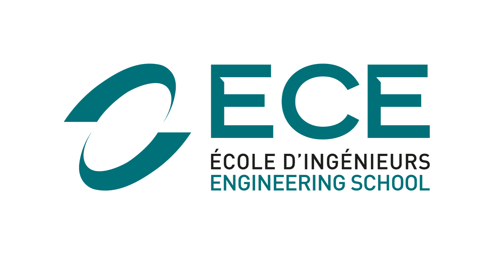

<script type="module">
  import mermaid from 'https://cdn.jsdelivr.net/npm/mermaid@10/dist/mermaid.esm.min.mjs';
    mermaid.initialize({ 
        startOnLoad: true,
        theme: 'base',
    });
    
</script>

<!--
# Style lead only for this slide
_class: lead
-->


**INGx** Matière (ex: Algo. et prog. en C)

# Projet

Toto TOTO - Tata TATA
Titi TITI - Tutu TUTU

---

<!-- _class: team -->

# Equipe

-  Toto TOTO
-  Tata TATA
-  Titi TITI
-  Tutu TUTU

---

# Documentation

Vous trouverez la [documentation de Marp](https://marpit.marp.app/markdown) à l'adresse suivante :
[https://marpit.marp.app/markdown](https://marpit.marp.app/markdown)


---

# Titre


## Sous-titre

Un exemple de texte avec des mots en **"gras" (couleur)**, en *italique*, et même les ***deux*** ! On peut placer \* grâce au caractère d'échappement (`\`).

Ce texte est en :fr: **français**, et peut comporter des *emojis* :blush: que vous pourrez trouver à [cette adresse](https://github-emoji-picker.rickstaa.dev/).

<br> <!-- Balises HTML autorisées, ici retour à la ligne -->

Comme vous pouvez le voir ici, une image (``) de fond (`bg`) ce trouve à droite (`right`), elle occupe `50%` de `30%` de la slide.

<sup>Texte en petit (correspond à l'**exposant**).</sup>
<sub>Texte en petit (correspond à l'**indice**).</sub>

---

# Image


## Une image intégrée au texte, de **300px** de large




---

# Listes

## Non ordonnées

- Item
- Item

## Ordonnées

1. Item 1
1. Item 2

---

# Code **C** / **Java**

<!-- Les balises HTML servent ici à créer deux colonnes -->
<div class="grid grid-cols-2 gap-4">
<div>

#### Langage C

```C
struct Heure {
    int heure;
    int minute;
};

typedef struct Heure Heure;

void afficherHeure(Heure h){
    printf("%d:%d\n", h.heure, h.minute);
}

int main() {
    Heure h1; h1.heure = 8; h1.minute = 37;
    Heure h2; h2.heure = 15; h2.minute = 3;
    afficherHeure(h1);
    afficherHeure(h2);
    return 0;
}
```
</div>
<div>

#### Langage Java

```Java
public class Heure {
    private int heure;
    private int minute;

    public Heure(int h, int m) {
        this.heure = h;
        this.minute = m;
    }

    public void afficherHeure(){
        System.out.println(heure + ":" + minute);
    }

    public static void main(String[] args) {
        Heure h1 = new Heure(8, 37);
        Heure h2 = new Heure(15, 3);
        h1.afficherHeure();
        h2.afficherHeure();
    }
}
```
</div>
</div>

---

# Terminal

```C
printf("Hello World!\n");
```
> Hello World!

---

# Tableaux

|Col 1|Col 2|Col 3|
|:---|:---:|---:|
|Alignement à gauche<br>(`:---` ou `---`)|Alignement au centre<br>(`:---:`)|Alignement à droite<br>(`---:`)|
|Aaaa|Bbbbb|Ccccc|

Le texte de cette slide est de taille normale.

---

<!-- _class: small -->

# Tableaux plus petits

|Col 1|Col 2|Col 3|
|:---|:---:|---:|
|Alignement à gauche<br>(`:---` ou `---`)|Alignement au centre<br>(`:---:`)|Alignement à droite<br>(`---:`)|
|Aaaa|Bbbbb|Ccccc|

---

<!--
_class: titre
-->

# Gros titre
